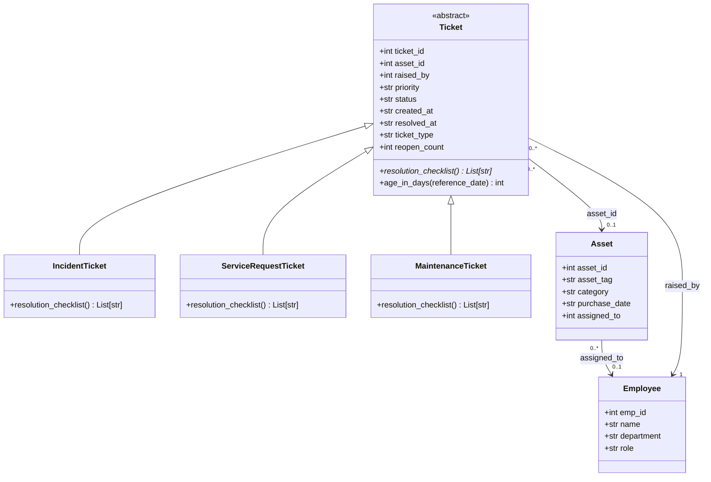
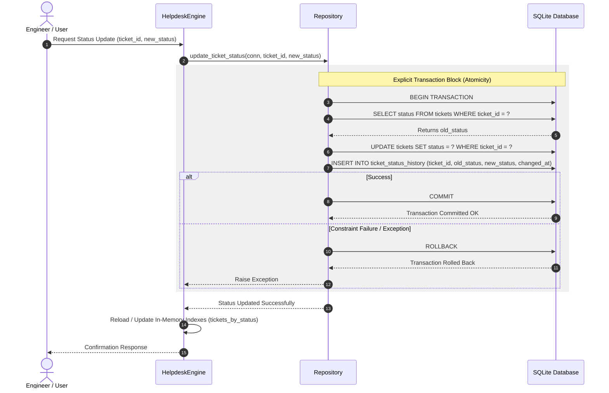

# SentinelDesk — System Architecture & Design Document (`DESIGN.md`)

This design document presents the High-Level Architecture, Low-Level Component Design, UML Diagrams, and Scale-Readiness Roadmap for **SentinelDesk**, Zoho's internal IT asset and ticket management platform.

---

## 1. High-Level Design (HLD)

SentinelDesk is structured as a classic **4-Layer Architecture** (Presentation, Business Logic, Data Access, and Database), providing clean separation of concerns, high maintainability, and testability.

```
+-----------------------------------------------------------------------+
|                         PRESENTATION LAYER                            |
|  (CLI / Test Runners / run_concurrency_experiment.py / README.md)     |
+-----------------------------------------------------------------------+
                                   |
                                   v
+-----------------------------------------------------------------------+
|                           BUSINESS LAYER                              |
|  (HelpdeskEngine, Ticket, IncidentTicket, ServiceRequestTicket,       |
|                       MaintenanceTicket)                              |
+-----------------------------------------------------------------------+
                                   |
                                   v
+-----------------------------------------------------------------------+
|                         DATA ACCESS LAYER                             |
|  (Repository [repository.py], Raw SQL Reporting Scripts [reports/])   |
+-----------------------------------------------------------------------+
                                   |
                                   v
+-----------------------------------------------------------------------+
|                          DATABASE LAYER                               |
|       (SQLite RDBMS, Schema [schema.sql], Seed Data [seed_data.sql])  |
+-----------------------------------------------------------------------+
```

### Layer Mapping to Project Artifacts:

1. **Presentation Layer**: 
   In this initial release, the Presentation layer is represented by the command-line entry points, test scripts, and execution scripts such as `run_concurrency_experiment.py` and the `README.md` interactive demonstration CLI. It accepts user inputs, triggers operations, and formats output summaries.

2. **Business Layer**: 
   Houses the domain model and in-memory indexing logic. The core domain entities are defined by the abstract base class `Ticket` and its concrete subclasses (`IncidentTicket`, `ServiceRequestTicket`, `MaintenanceTicket`), alongside plain data entities `Employee` and `Asset`. The `HelpdeskEngine` class encapsulates business indexing, maintaining dictionary mappings (`employees_by_id`, `assets_by_id`, `tickets_by_status`) and aggregate counters (`count_by_type_status`) for O(1) in-memory lookups.

3. **Data Access Layer**: 
   Consists of the `Repository` class (`repository.py`) and specialized report queries (`reports/*.sql`). `Repository` manages transactional database operations (such as `update_ticket_status`), enforcing atomic writes across both `tickets` and `ticket_status_history`.

4. **Database Layer**: 
   Relies on SQLite (`schema.sql` and `seed_data.sql`), enforcing Third Normal Form (3NF) relational constraints, foreign keys, and `CHECK` constraints on ticket priorities and statuses.

---

## 2. Low-Level Design (LLD) & SOLID Principles

Each major component in SentinelDesk adheres to a specific SOLID object-oriented design principle:

1. **`Ticket` — Open-Closed Principle (OCP)**
   The abstract base class `Ticket` is open for extension by deriving concrete ticket subclasses (e.g., `IncidentTicket`, `ServiceRequestTicket`, `MaintenanceTicket`), but closed for modification because adding new ticket types into SentinelDesk requires no changes to the base class interface or its shared helper methods.

2. **`IncidentTicket` — Liskov Substitution Principle (LSP)**
   Concrete subclasses such as `IncidentTicket` can be substituted seamlessly wherever an abstract `Ticket` reference is expected (such as in `HelpdeskEngine` index structures or the `notify()` function) without breaking program execution or throwing unexpected runtime exceptions.

3. **`HelpdeskEngine` — Single Responsibility Principle (SRP)**
   `HelpdeskEngine` has the sole responsibility of orchestrating domain entity loading and maintaining in-memory indexes for fast lookup, completely delegating database connection lifecycle and transactional writes to the data access layer.

4. **`Repository` — Dependency Inversion Principle (DIP)**
   `Repository` depends on high-level connection abstractions (`sqlite3.Connection`) passed explicitly into its methods rather than instantiating or coupling to hardcoded database connection strings, enabling effortless dependency injection during unit testing.

5. **`Asset` — Interface Segregation Principle (ISP)**
   The `Asset` domain class exposes a minimal, focused interface limited exclusively to asset attributes (`asset_id`, `asset_tag`, `category`, `purchase_date`, `assigned_to`), ensuring consuming components do not depend on unused methods or irrelevant fields.

---

## 3. Architecture Diagrams

### 3.1 Domain Class Diagram


### 3.2 Sequence Diagram: Status Update & Transaction Flow


---

## 4. Scale-Readiness Design Note

As SentinelDesk scales from a few hundred engineers to thousands across multiple offices, the platform must address scalability, load balancing, and microservices decomposition.

### 4.1 Horizontal vs. Vertical Scaling

* **First System Bottleneck**: 
  As ticket volume grows, the `tickets` table becomes the primary bottleneck due to write lock contention in SQLite and heavy analytical reporting queries. Specifically, report queries like `report_employees_above_average.sql` (Report D) and `report_employee_rank_window.sql` (Report G) perform full table scans, subqueries, and window sorting across all tickets.
* **Scaling Strategy**: 
  In the immediate term, **vertical scaling** (upgrading database host CPU, memory, and NVMe IOPS) resolves write lock waiting times and speeds up in-memory sorting. However, as read volume scales, transitioning from SQLite to PostgreSQL with **read-replicas** allows horizontal scaling of reporting workloads: all write transactions target the primary database node, while heavy analytical reports (Task 4) are offloaded to read-only replicas.

### 4.2 Load Balancing Strategy

* **Selected Algorithm**: **Least Connection**
* **Justification**: 
  The **Least Connection** algorithm routes incoming HTTP requests to the SentinelDesk application instance currently processing the fewest active connections. Because ticket creation, resolution checklist processing, and complex reporting queries require varying CPU and execution times, Round Robin could overload an instance processing heavy queries, whereas Least Connection dynamically balances real-time server load.
* **Statelessness Requirement**: 
  Statelessness matters to this choice because any SentinelDesk instance can process any incoming status update or ticket query without relying on local session memory, enabling the load balancer to freely route requests to whichever instance is least loaded without sticky sessions.

### 4.3 Microservices Decomposition

* **Proposed Service Split**: 
  Decompose the monolithic architecture into two independently deployable microservices:
  1. **Asset Management Service**: Manages hardware inventory, asset lifecycle, and employee asset assignments.
  2. **Ticketing Service**: Manages ticket creation, workflow state transitions, resolution checklists, and ticket history.
* **Data Consistency Challenge**: 
  Decoupling these domains eliminates hard database foreign key constraints (`tickets.asset_id REFERENCES assets(asset_id)`). This introduces the trade-off of maintaining cross-service data consistency—for example, preventing a ticket from being assigned to an asset that was deleted or re-assigned in the Asset Service.
* **Consistency Handling & Ownership**: 
  The **Asset Management Service** owns the `assets` table as its sole source of truth. The **Ticketing Service** maintains an asynchronous event-driven subscription (or cached REST validation) to verify `asset_id` references. Assets cannot be hard deleted; instead, the Asset Service enforces soft deletion (`is_active = false`), ensuring historical tickets in the Ticketing Service maintain immutable reference integrity without cascading data corruption.
